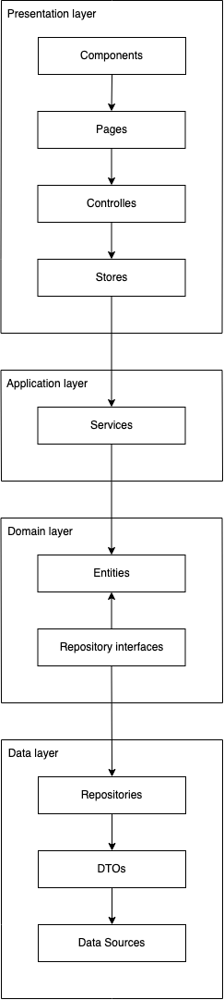

# Clean Architecture in Vue

Clean architecture is a design pattern that aims to separate application
logic from user interface or external services. It does that by defining
layers in a circle, in which each layer can only interact with other layers
towards the center of the circle.

In Vue terms, the layers would be (from outer to inner) **Components + Pages + Controllers + Stores -> Services -> Entities <- Repositories**.



## Domain

The Domain layer contains entities which define the basic data that our
application will use.
The Domain is an abstract view of the world — containing only the facts
relevant to the business.

### Entities

This is a class or type definition that defines the data and domain
restrictions of objects in our application.

```typescript
// src/modules/bookmarks/domain/entities/Bookmark.ts

export interface Bookmark {
  id: string;
  name: string;
  url: string;
  createdAt: number;
  updatedAt: number;
}
```

---

- [Using TypeScript to map out your business domain](https://medium.com/@hayavuk/using-typescript-to-map-out-your-business-domain-69af4a8d109b)

### Repositories interfaces

This is an interface that defines all use cases and operations for an entity.

```typescript
// src/modules/bookmarks/domain/repositories/BookmarkRepository.ts

import { Bookmark } from 'src/modules/bookmarks/domain/entities';

export interface BookmarkRepository {
  getAll(): Promise<Bookmark[]>;
  findById(id: string): Promise<Bookmark | undefined>;
  add(bookmark: Bookmark): Promise<Bookmark>;
  update(bookmark: Bookmark): Promise<Bookmark>;
  delete(id: string): Promise<void>;
}
```

## Data

The Data layer contains the data access logic.

### Repositories

This is an implementation of the repository interface from the Domain level.

## Application

The Application layer contains all the logic and operations applied to the
entities.

### Services

From a technical perspective, it can be anything: class, function, a cluster
of functions, and an object with methods. The only rule: keep it away from
“details”: frameworks, stores, UI, etc. The only dependency Service should
have are Entities or other Services.
From a conceptual point of view, the goal of services is to perform required
business operations on Entities.
There could be one service for each entity, for example, a BookmarkService
would have all the logic for interacting with the Bookmark entity, like
fetching, creating, editing, deleting.
If you are familiar with the Repository-Service pattern, which is quite popular
in the backend world, you may find a lot of similarities.

---

- [Laravel Architecture Design: Service Repository Pattern Implementation](https://medium.com/@mianhaseeb41/laravel-architecture-design-service-repository-pattern-implementation-4f663281f5f7)
- [Decoding Async/Await in TypeScript: An Adventure in Refactoring with Decoupling and Domain-Driven Design](https://levelup.gitconnected.com/decoding-async-await-in-typescript-an-adventure-in-refactoring-with-decoupling-and-domain-driven-77b252c2c869)

## Presentation

The presentation layer is responsible for interacting with the user interface.
It contains the user interface, the stores and controllers, this is mostly the
Vue part of the app.

### Stores

This is where your data is stored.

### Controllers

The controller is an element that is called from the page or container
(smart component), executes tasks through a store and returns the result to the
page or container.
There should be one controller for each operation.

```typescript
// src/modules/bookmarks/presentation/controllers/useGetBookmarksController.ts

import { useQuasar } from 'quasar';
import { storeToRefs } from 'pinia';

import { useBookmarksStore } from 'src/modules/bookmarks/presentation/stores';

export const useGetBookmarksController = () => {
  const quasar = useQuasar();

  const bookmarksStore = useBookmarksStore();

  const { bookmarks, totalBookmarks, hasBookmarks } = storeToRefs(bookmarksStore);

  const getBookmarks = async () => {
    try {
      quasar.loading.show();
      await bookmarksStore.getBookmarks();
    } catch (error) {
      quasar.notify({ type: 'negative', message: (error as Error).message });
    } finally {
      quasar.loading.hide();
    }
  };

  return {
    bookmarks,
    totalBookmarks,
    hasBookmarks,
    getBookmarks,
  };
};
```

### Components

This is the Vue component we know.

## Example

See a full example of a [project](https://github.com/yuzumi/booky) that
implements clean architecture approach.

## Other examples

- [vue-shopping-clean-architecture](https://github.com/thanhchungbtc/vue-shopping-clean-architecture)
- [nuxt-clean-architecture](https://gitlab.com/dirodriguezm/nuxt-clean-architecture)
- [hexagonal-architecture-frontend](https://github.com/juanm4/hexagonal-architecture-frontend)
- [vue-clean-architecture](https://github.com/smotastic/vue-clean-architecture)
- [vue-vuex-ts](https://github.com/soloschenko-grigoriy/vue-vuex-ts)
- [clean-typescript-react](https://github.com/nanosoftonline/clean-typescript-react)
- [flexible-counter-app](https://github.com/itshugota/flexible-counter-app)
- [scalable-express-tutorial](https://github.com/csalazar94/scalable-express-tutorial)
- [clean-mvvm-react](https://github.com/nanosoftonline/clean-mvvm-react)
- [clean-typescript-react](https://github.com/nanosoftonline/clean-typescript-react)
- [clean-architecture](https://github.com/lulusir/clean-architecture)
- [react-clean-architecture](https://github.com/eduardomoroni/react-clean-architecture)

## Sources

- [The Benefits of Using Clean Architecture in Vue](https://www.mitrais.com/news-updates/the-benefits-of-using-clean-architecture-in-vue/)
- [Clean Architecture: Typescript and React](https://paulallies.medium.com/clean-architecture-typescript-and-react-8e509098abfe)
- [Clean Architecture: TypeScript and React](https://codefoundation.co.za/clean-architecture-typescript-and-react)
- [A different approach to frontend architecture](https://dev.to/itshugo/a-different-approach-to-frontend-architecture-38d4)
- [Vertical Slices of Clean Architecture](https://paulallies.medium.com/vertical-slices-of-clean-architecture-ee6db87490a3)
- [The Life-changing (And Time-saving!) Magic Of Feature Focused Code Organization!](https://dev.to/jamesmh/the-life-changing-and-time-saving-magic-of-feature-focused-code-organization-1708)
- [Building a Flexible and Scalable Node.js Backend with Express: A Step-by-Step Tutorial](https://medium.com/@csalazar94/building-a-flexible-and-scalable-node-js-backend-with-express-a-step-by-step-tutorial-5a8633335b48)
- [Clean MVVM with React and React Hooks](https://paulallies.medium.com/clean-mvvm-with-react-and-react-hooks-ebc37b22542f)
- [How to Implement Clean Architecture with Node.js](https://medium.com/@lujavascript/how-to-implement-clean-architecture-with-node-js-c2b3bbfd3c7f)
- [A domain-driven Vue.js Architecture](https://medium.com/bauer-kirch/a-domain-driven-vue-js-architecture-77771c20f0da)
- [Improve React Component Maintainability with Layered Architecture](https://blog.bitsrc.io/improve-react-component-maintainability-with-layered-architecture-25e74ba86430)
- [Clean Architecture in Node.js](https://medium.com/@ben.dev.io/clean-architecture-in-node-js-39c3358d46f3)
- [Building a Clean Architecture Application with .NET Core: A Step-by-Step Guide](https://medium.com/@pantaanish/building-scalable-applications-with-clean-architecture-in-net-core-web-api-d5e00ad35764)

---

- [Implementing a Clean Architecture Modular Application in Nuxt/Vue Typescript Part 1: Domain Layer](https://dirodriguezm.gitlab.io/nuxt-clean-architecture.html)
- [Implementing a Clean Architecture Modular Application in Nuxt/Vue Typescript Part 2: Services](https://dirodriguezm.gitlab.io/nuxt-clean-architecture-part2.html)
- [Implementing a Clean Architecture Modular Application in Nuxt/Vue Typescript Part 3: Vuex Store](https://dirodriguezm.gitlab.io/nuxt-clean-architecture-part3.html)
- [Implementing a Clean Architecture Modular Application in Nuxt/Vue Typescript Part 4: UI Components](https://dirodriguezm.gitlab.io/nuxt-clean-architecture-part4.html)

---

- [Building an Enterprise Application with Vue](https://javascript.plainenglish.io/building-vue-enterprise-application-part-0-overture-6d41bea14236)
- [Building Vue Enterprise Application: Part 1. Entities](https://levelup.gitconnected.com/building-vue-enterprise-application-part-1-entities-808077f3d2e7)
- [Building Vue Enterprise Application: Part 2. Services](https://javascript.plainenglish.io/building-vue-enterprise-application-part-2-services-f7ec400190e7)
- [Building Vue Enterprise Application: Part 3. The Store](https://itnext.io/building-vue-enterprise-application-part-3-the-store-dbda0e4bb117)
- [Building Vue Enterprise Application: Part 4. UI components](https://itnext.io/building-vue-enterprise-application-part-4-ui-components-21a45b3067a4)

---

- [Flutter Project Structure: Feature-first or Layer-first?](https://codewithandrea.com/articles/flutter-project-structure/)
- [Flutter App Architecture with Riverpod: An Introduction](https://codewithandrea.com/articles/flutter-app-architecture-riverpod-introduction/)
- [Flutter App Architecture: The Repository Pattern](https://codewithandrea.com/articles/flutter-repository-pattern/)
- [Flutter App Architecture: The Domain Model](https://codewithandrea.com/articles/flutter-app-architecture-domain-model/)
- [Flutter App Architecture: The Application Layer](https://codewithandrea.com/articles/flutter-app-architecture-application-layer/)
- [Flutter App Architecture: The Presentation Layer](https://codewithandrea.com/articles/flutter-presentation-layer/)

---

- [How Clean Architecture enables McDonald’s to optimize market-specific needs and user experience](https://medium.com/mcdonalds-technical-blog/how-clean-architecture-enables-mcdonalds-to-optimize-market-specific-needs-and-user-experience-b31b8a0ad4f9)
- [A Practical Approach to Clean Architecture in C# .NET](https://maherz.medium.com/a-practical-approach-to-clean-architecture-in-c-net-13fe27ea23b1)
- [Laravel Domain Driven Design: A Comprehensive Guide](https://medium.com/@mianhaseeb41/laravel-domain-driven-design-a-comprehensive-guide-c8b12c7ad79a)